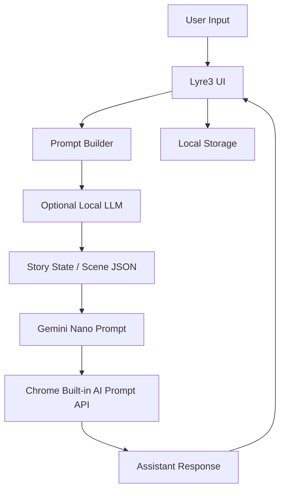

# Lyre3 Chat System Design

## 全体構成



## 役割分担

### 1. Lyre3 UI

- 人格選択
- カスタム指示編集
- 物語開始と会話表示
- モデル準備状況の表示
- プロンプト確認と保存

### 2. 裏側の LLM

- 物語の骨組みを作る
- 固定登場人物を整理する
- シーンの要約を短く保つ
- Gemini Nano に渡すための構造化データを作る

### 3. Gemini Nano

- 実際の返答生成
- 会話の自然さの確保
- プレイヤーの返答に対する即時応答

## 主要データ

### Persona

```json
{
  "presetId": "story",
  "customPrompt": "必要なら編集される追加指示"
}
```

### System Prompt

- 現在の人格設定から生成される
- 直接編集も可能
- `localStorage` に保存される

### Story State

```json
{
  "scene": "駅前の古い歩道橋",
  "characters": [
    { "name": "ミナ", "role": "案内役" },
    { "name": "レイ", "role": "警戒役" },
    { "name": "ユーザー", "role": "主人公" }
  ],
  "goal": "青い扉の意味を探る",
  "lastEvent": "扉の前に人影が立っている"
}
```

### Fixed Cast

```json
[
  {
    "name": "ミナ",
    "role": "案内役",
    "personality": "明るく好奇心旺盛。場面を前に進める",
    "speech": "親しみやすく自然。ユーザーに最初に声をかける"
  },
  {
    "name": "レイ",
    "role": "警戒役",
    "personality": "落ち着いていて慎重。違和感を拾う",
    "speech": "簡潔で少し冷静。危険や気になる点を指摘する"
  },
  {
    "name": "カナ",
    "role": "観察役",
    "personality": "静かで観察眼が鋭い。細部をつなぐ",
    "speech": "やわらかいが端的。手がかりや状況を整理する"
  }
]
```

## 物語開始フロー

1. ユーザーが `ゲームマスター` を選ぶ
2. アプリが初回導入用のプロンプトを組み立てる
3. Gemini Nano が短い情景描写を返す
4. 固定登場人物の誰かがユーザーに話しかける
5. ユーザーの返答を受けて次のシーンへ進む

## 会話ルール

- ユーザーの行動は勝手に確定しない
- 登場人物の名前と口調は毎回維持する
- 新しい登場人物を増やしすぎない
- 毎回長く説明しない
- 最後に次の行動余地を残す

## プロンプト生成方針

### 入力

- 現在の人格
- ユーザーのカスタム指示
- 世界観メモ
- 直近の会話履歴
- 短く圧縮したストーリー状態

### 出力

- Gemini Nano 向けの最終プロンプト
- 必要に応じたシーン開始文
- 必要に応じた会話継続文

## 保存対象

- 会話履歴
- 人格設定
- カスタム指示
- 編集済みプロンプト

## 拡張候補

- シーンテンプレートの追加
- 登場人物ごとの性格カード
- 章立ての導入
- 物語の分岐メモ
- エクスポート / インポート
